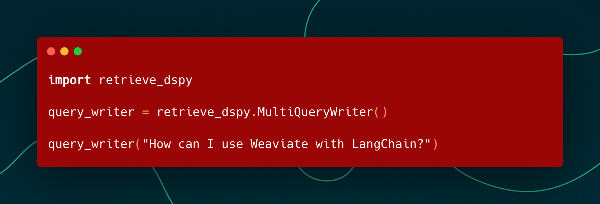
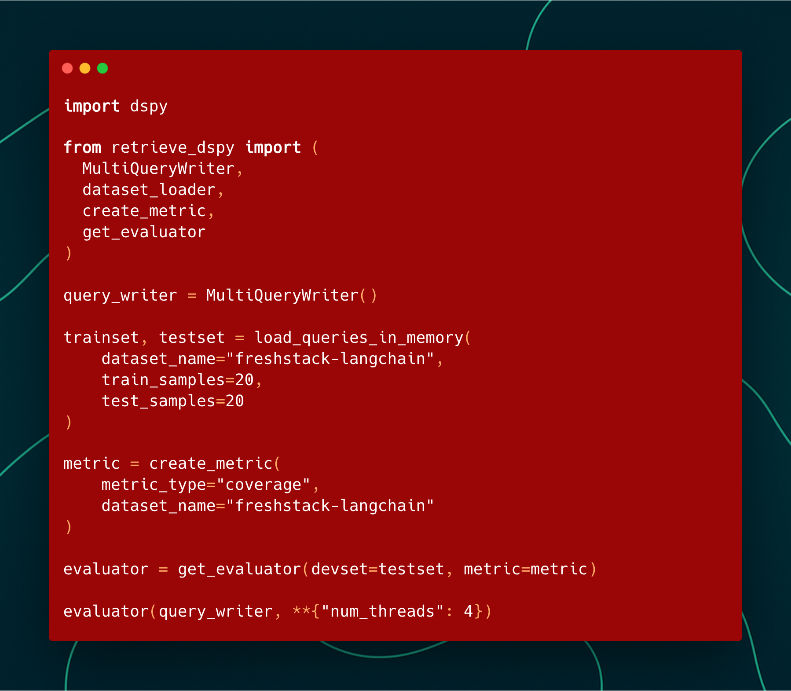
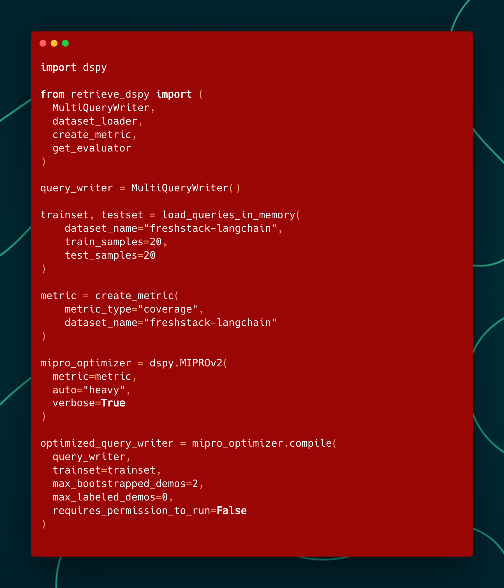

# retrieve-dspy


`retrieve-dspy` contains pre-built Compound AI Systems for retrieval with DSPy.



`retrieve-dspy` contains evaluator code for the FreshStack and EnronQA benchmarks.



You can easily interface `retrieve-dspy` pipelines with DSPy's optimizers.



### Run Tests with:

```bash
uv run python scripts/run-eval.py
```